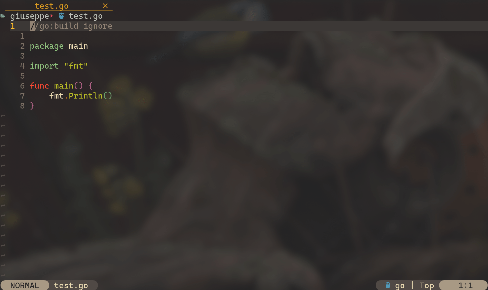

# pets.nvim

Pets.nvim is a plugin that provides the missing core functionality of showing little animal friends inside your editor.
It relies on the [kitty graphics protocol](https://sw.kovidgoyal.net/kitty/graphics-protocol/) and [hologram.nvim](https://github.com/edluffy/hologram.nvim) to be able to display images in a terminal window.
As you might know the plugin is heavily inspired by [vscode-pets](https://github.com/tonybaloney/vscode-pets/tree/master/media).
If you like the art for the pets, check out the [Credits](#-Credits) section.

<!-- panvimdoc-ignore-start -->

<!-- panvimdoc-ignore-end -->

## ⚠️ Limitations

This plugin relies on [hologram.nvim](https://github.com/edluffy/hologram.nvim) to display the images,
and shares all of its limitations. Here are the most significant ones:
- Only works with terminal emulators that support the [kitty graphics protocol](https://sw.kovidgoyal.net/kitty/graphics-protocol/)
    To be more precise the only terminal I tested where I was able to have the protocol working correctly is kitty itself.
- Doesn't currently work inside tmux

## 📦 Installation

Install with your favorite package manager!

Examples:

With packer:
```lua
use({
  "giusgad/pets.nvim",
  requires = {
    "giusgad/hologram.nvim",
    "MunifTanjim/nui.nvim",
  }
})
```
With lazy:
```lua
{
  "giusgad/pets.nvim",
  dependencies = { "MunifTanjim/nui.nvim", "giusgad/hologram.nvim" },
}
```
And then call 
```lua
require("pets").setup({
  -- your options here
})
```
>Note: if you want to use the original `hologram.nvim` instead of my fork,replace `giusgad/hologram.nvim` with `edluffy/hologram.nvim`.
>My fork for now only fixes errors with hologram `auto_display = true`, and the plugin should not have any other issues with the original.

## ⚙️ Configuration

This is the default configuration:
```lua
{
  row = 1, -- the row (height) to display the pet at (higher row means the pet is lower on the screen), must be 1<=row<=10
  col = 0, -- the column to display the pet at (set to high number to have it stay still on the right side)
  speed_multiplier = 1, -- you can make your pet move faster/slower. If slower the animation will have lower fps.
  default_pet = "dog", -- the pet to use for the PetNew command
  default_style = "brown", -- the style of the pet to use for the PetNew command
  random = true, -- whether to use a random pet for the PetNew command, overrides default_pet and default_style
  death_animation = true, -- animate the pet's death, set to false to feel less guilt -- currently no animations are available
  popup = { -- popup options, try changing these if you see a rectangle around the pets
    width = "30%", -- can be a string with percentage like "45%" or a number of columns like 45
    winblend = 100, -- winblend value - see :h 'winblend' - only used if avoid_statusline is false
    hl = { Normal = "Normal" }, -- hl is only set if avoid_statusline is true, you can put any hl group instead of "Normal"
    avoid_statusline = false, -- if winblend is 100 then the popup is invisible and covers the statusline, if that
    -- doesn't work for you then set this to true and the popup will use hl and will be spawned above the statusline (hopefully)
  }
}
```

## 📑 Usage - commands

These are all the available commands:
- `PetsNew {name}`: creates a pet with the style and type defined by the configuration, and name {name}
- `PetsNewCustom {type} {style} {name}`: creates a new pet with type, style and name specified in the command
- `PetsList`: prints the names of all the pets that are currently alive
- `PetsKill {name}`: kills the pet with given name, which will immediately blink out of existence. Forever.
- `PetsKillAll`: kills all the pets, poor creatures. Works just as PetsKill but for every pet.
- `PetsRemove`/`PetsRemoveAll` as `PetsKill` and `PetsKillAll` but without animation.
- `PetsPauseToggle`: pause/resume animations for all pets, leaving them on screen as cute little statues
- `PetsHideToggle`: pause the animation for all pets and hide them / show all the pets again and resume animations
- `PetsIdleToggle`/`PetsSleepToggle`: basically a do-not-disturb mode, pets are still animated but do not move around

## ❔ FAQ - if something doesn't work

- If the pet is not at the height you desire change the `row` option (higher row means the pet is displayed lower on the screen)
- If you're seeing a square around the pets, try setting `avoid_statusline` to `true`. If you're still seeing it
    try setting `winblend` to 0 or using a custom highlight group as shown [above](#-Configuration) and in #8.
- If you don't see the pet at all checkout the [limitations](#-Limitations) and try changing the row value.

## 🐾 Available pets

| Pet | Styles |
|:---:|:-------:|
|dog|brown, black, gray, beige|
|slime|green, pink, orange, blue|
|clippy|black, brown, green, yellow|
|cockatiel|gray|
|crab|red|
|mod|purple|
|rocky|gray|
|rubber duck|yellow|
|snake|green|
|zappy|yellow|

<!-- panvimdoc-ignore-start -->

<!-- panvimdoc-ignore-end -->

## 👏 Credits

- The dog assets were created by [NVPH Studio](https://nvph-studio.itch.io/dog-animation-4-different-dogs). All the details about the license
can be found [here](https://creativecommons.org/licenses/by-nd/4.0/#).
- The slime was created by me (for now it follows the MIT license):) 
- The Clippy, Rocky, Zappy, rubber duck, snake, cockatiel, Ferris the crab, and Mod the dotnet bot assets were created by [Marc Duiker](https://twitter.com/marcduiker) for [vscode-pets](https://github.com/tonybaloney/vscode-pets) ([license](https://github.com/tonybaloney/vscode-pets/blob/master/LICENSE)).
- The old cat assets were designed by [SeethingSwarm](https://seethingswarm.itch.io/catset).

<!-- panvimdoc-ignore-start -->
## 🙏 Acknowledgements

A big thanks to everyone that helped, helps or will help the project!

<a href="https://github.com/giusgad/pets.nvim/graphs/contributors">
  
</a>

Note that the repo was deleted and recreated in order to remove some of the old cat assets
that were still visible in the cache of some pull requests.

<!-- panvimdoc-ignore-end -->
